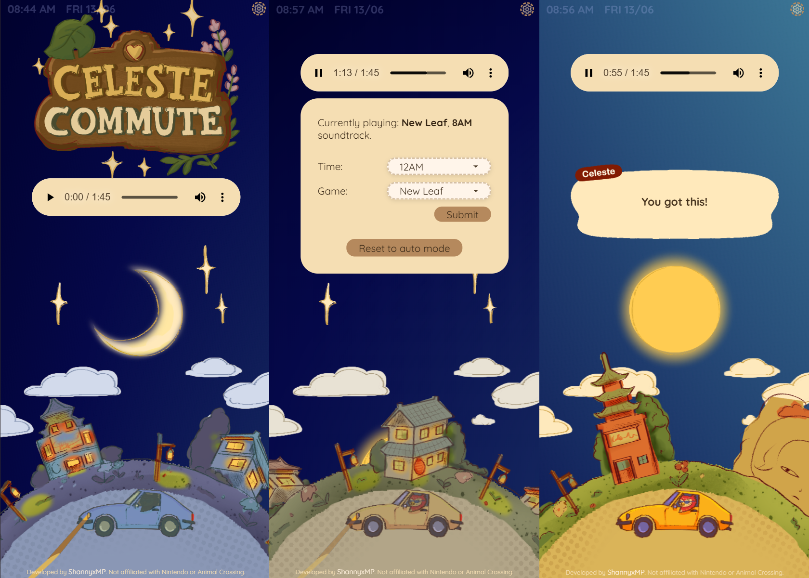

# Celeste Commute

## Table of contents

- [Overview](#overview)

- [Screenshot](#screenshot)

- [Getting started](#getting-started)

- [My process](#my-process)

- [Built with](#built-with)

- [What I learned](#what-i-learned)

- [Continued development](#continued-development)

- [Useful resources](#useful-resources)

- [Author](#author)

- [Acknowledgments](#acknowledgments)

- [Future Improvements](#future-improvements)

## Overview

### Screenshot



## Getting started

To run this project locally:

1. Clone the repository
2. Run `npm install` to install dependencies
3. Run `node index.js`
4. Open `http://localhost:3000` in your browser

## My process

### Built with

- CSS custom properties
  - Flexbox
  - CSS Grid
- Mobile-first workflow
- JavaScript
- Node.js
- Express.js
- NPM: body-parser, axios

### What I learned

This project was a capstone project for a full-stack web development course, focused on integrating APIs. I used an API that streams soundtracks from various _Animal Crossing_ games. Data handling between the client and the server remains a challenge for me, but this has been one of my favourite projects so far.

The project initially fetched soundtracks based on the current hour. As I added more features - such as automatically updating the soundtrack when the hour changed - conflicts arose. Specifically, when a user selected a specific time (and thus a specific soundtrack), the auto-polling feature would override the selection every 30 seconds. To resolve this, I moved away from tracking input using global booleans and used URL flags instead.

Here is how I handled it on the server:

```js
app.post("/set-soundtrack", async (req, res) => {
  // Handle incoming request to change hourly soundtrack based on selected time by client
  const selectedTime = req.body.setTime; // Output eg.: 12AM

  if (selectedTime) {
    try {
      ... // Fetch soundtrack from API
      // Redirect to homepage with manual override flag
      res.redirect(`/?manual=true&time=${encodeURIComponent(selectedTime)}`);
      ...
    } catch (error) {
      ... // Error handling
    }
  }
});
```

And on the client side, I checked for this flag to disable auto-polling:

```js
const songWasRequested = window.location.search.includes("manual=true"); // Skip polling if the URL includes a manual override flag (?manual=true)

if (!songWasRequested) {
    setInterval(async () => {
      ... // Fetch new soundtrack from server
    }, 30000); // To fetch data every 30secs
}
```

This small shift made a big difference in user experience and taught me a lot about clean client-server communication.

### Continued development

Animating elements based on my own drawings made this one of the most enjoyable parts of the project. I have only scratched the surface of CSS animations, and I hope to refine this further in future iterations. I would like to add more subtle animations to create depth, while ensuring they do not distract from the purpose of this app - a calm, focused study space.

I also plan to practice working with more complex API routes. For this project specifically, I would love to add a feature that allows users to choose soundtracks from different _Animal Crossing_ games.

UPDATE: It is now possible for users to choose the Animal Crossing game they would like to listen to.

### Useful resources

- [Creating a Custom Audio Player](https://css-tricks.com/lets-create-a-custom-audio-player/) I have not implemented this yet, but it offers great tips I hope to follow when replacing the default browser player with a custom one.

## Author

<!-- TODO: -->

- Website - [ShannyxMP](https://www.your-site.com)

## Acknowledgments

- Huge thanks to Dr Angela Yu for providing such a clear and supportive learning experience in Full-stack Web Development.

- Thanks to [Matt](https://mattt.space/) for the [Animal Crossing API](https://ac-api.vercel.app/).

## Future improvements

- [ ] Customise audio player to match the theme
- [x] Allow users to select which game’s soundtrack to listen to
- [x] Refine layout
- [ ] Expand animations
- [x] Post kind reminders
- [x] Add a digital clock with local time
- [x] Add local date
- [ ] Store user-specific settings (like game/time) using sessions or query params - so multiple users don’t override each other’s soundtrack settings
